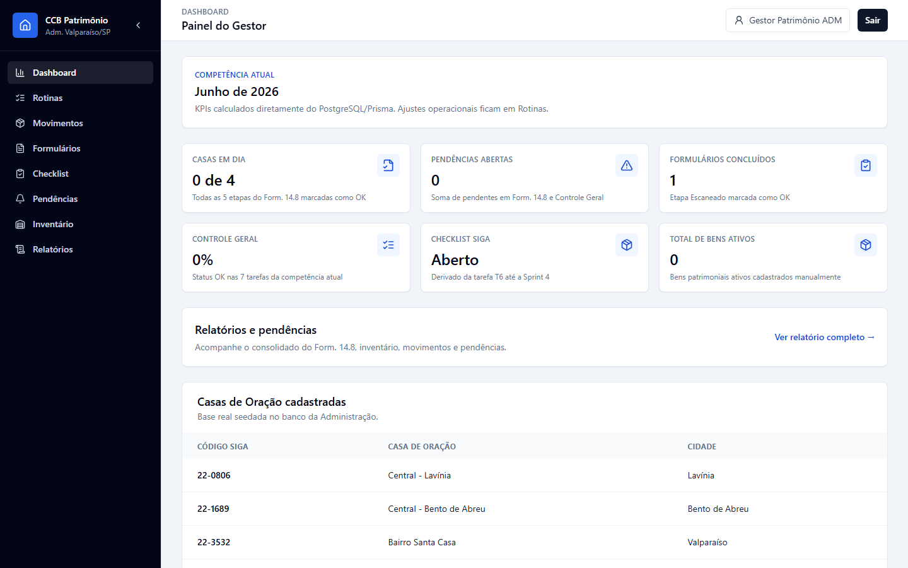
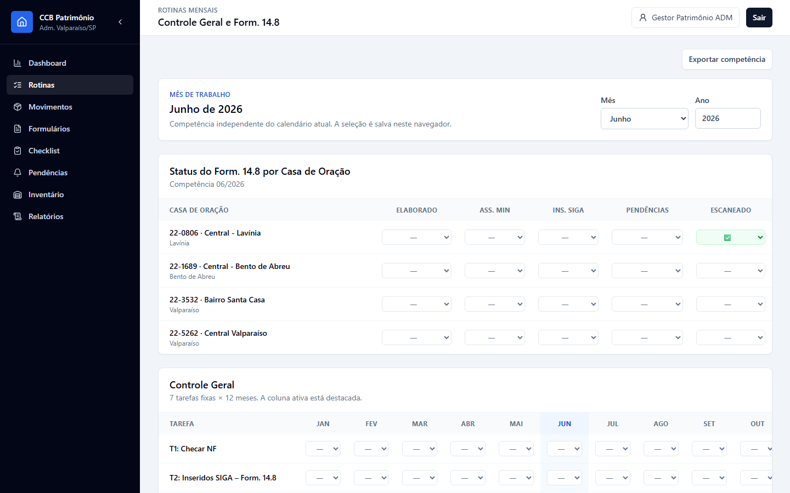
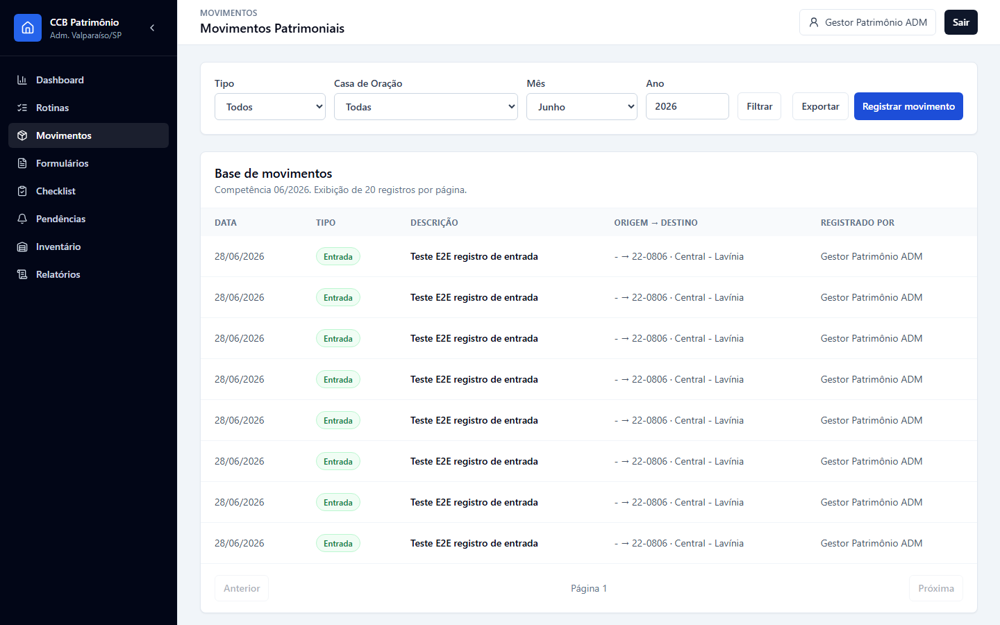
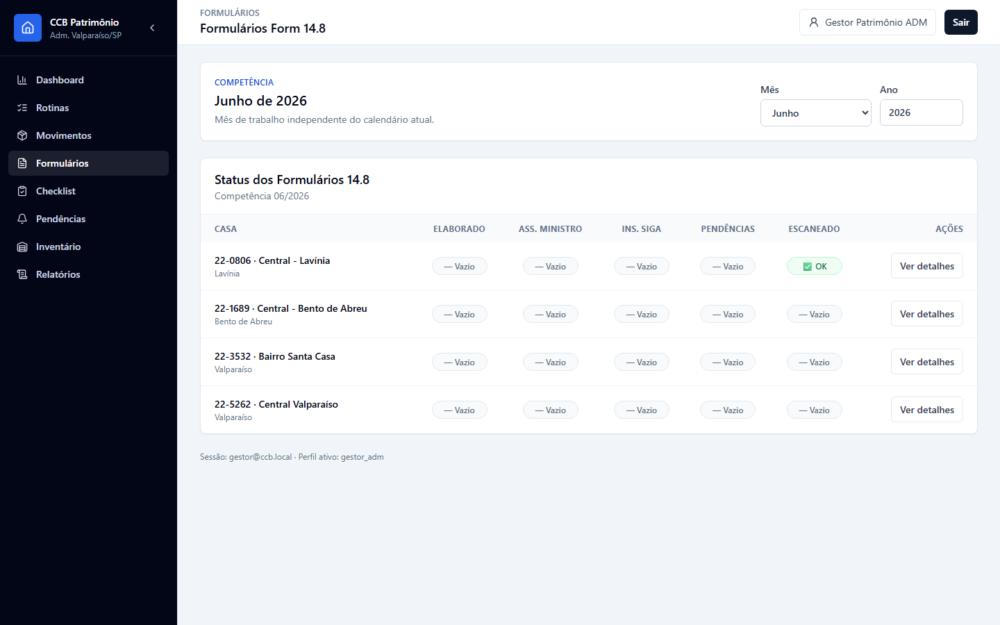
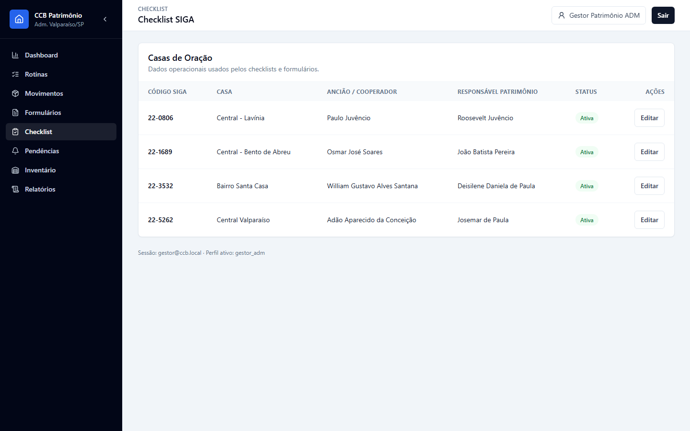
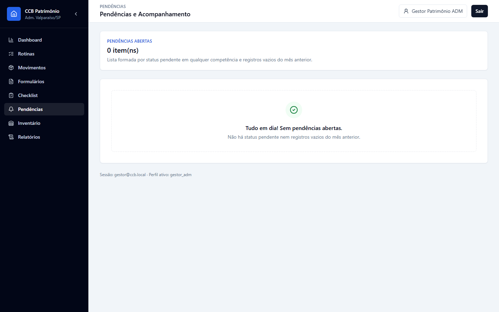
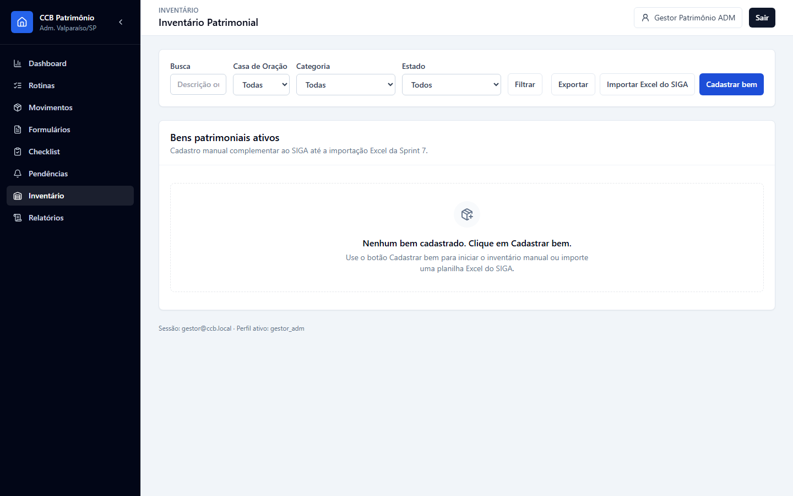
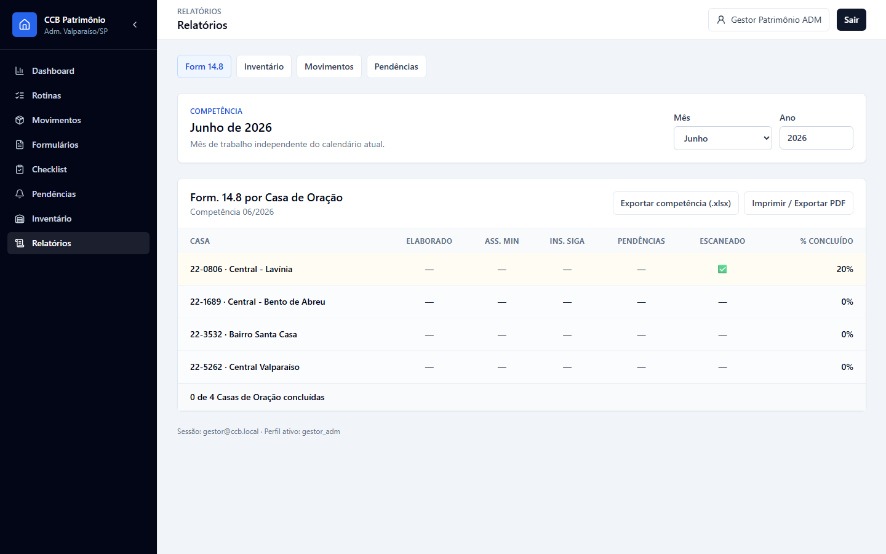

# Manual do Usuário — CCB Patrimônio

## Índice

- [1. Introdução](#1-introdução)
- [2. Perfis de Usuário e Permissões](#2-perfis-de-usuário-e-permissões)
- [3. Navegação Geral](#3-navegação-geral)
- [4. Seções do Sistema](#4-seções-do-sistema)
  - [4.1 Dashboard](#41-dashboard)
  - [4.2 Rotinas](#42-rotinas)
  - [4.3 Movimentos](#43-movimentos)
  - [4.4 Formulários](#44-formulários)
  - [4.5 Checklist](#45-checklist)
  - [4.6 Pendências](#46-pendências)
  - [4.7 Inventário](#47-inventário)
  - [4.8 Relatórios](#48-relatórios)
- [5. Fluxos Principais](#5-fluxos-principais)
  - [Entrar no sistema](#entrar-no-sistema)
  - [Atualizar o Form. 14.8 mensal](#atualizar-o-form-148-mensal)
  - [Acompanhar alerta de pendências do mês anterior](#acompanhar-alerta-de-pendências-do-mês-anterior)
  - [Anexar Form. 14.8 escaneado](#anexar-form-148-escaneado)
  - [Resolver pendências](#resolver-pendências)
  - [Registrar movimento patrimonial](#registrar-movimento-patrimonial)
  - [Cadastrar bem manualmente](#cadastrar-bem-manualmente)
  - [Importar bens do SIGA](#importar-bens-do-siga)
  - [Editar ou desativar bem](#editar-ou-desativar-bem)
  - [Editar dados de Casa de Oração](#editar-dados-de-casa-de-oração)
  - [Gerar relatórios](#gerar-relatórios)
- [6. FAQ](#6-faq)

## 1. Introdução

O CCB Patrimônio é o sistema de apoio à gestão de bens móveis da Administração Valparaíso/SP. Ele centraliza o acompanhamento mensal do Form. 14.8, controle geral de rotinas, movimentos patrimoniais, checklist de dados das Casas de Oração, inventário, pendências e relatórios.

URL de produção: <https://ccbpatrimoniovalpa.vercel.app>

O acesso é autenticado. Usuários sem sessão são direcionados para a tela de login. Após autenticação válida, o sistema abre a área interna de gestão.

## 2. Perfis de Usuário e Permissões

O código atual define apenas um perfil de usuário:

| Perfil | Permissões no sistema |
| --- | --- |
| `gestor_adm` | Acessar todas as telas internas, alterar rotinas e status do Form. 14.8, editar dados operacionais das Casas de Oração, registrar movimentos, anexar documentos, gerenciar inventário, importar Excel do SIGA, exportar relatórios e resolver pendências. |

Todas as ações sensíveis verificam se o usuário logado possui papel `gestor_adm`. O sistema registra ações relevantes em auditoria, como alterações de status, uploads, movimentos, edições de casas, criação/edição/desativação de bens e importação do SIGA.

Não há, no código atual, perfis separados para conferente, responsável local, regional ou somente leitura. Também não há fluxo de aprovação em múltiplas etapas por usuários diferentes; a aprovação operacional é representada pela mudança de status das etapas e pelo registro em auditoria.

Nota para evolução futura: caso o sistema passe a ter perfis como responsável local, conferente ou regional, esta seção deve ser atualizada com a matriz de permissões de cada papel e com os limites de acesso por Casa de Oração ou Administração.

## 3. Navegação Geral

Após o login, o usuário vê uma estrutura com menu lateral, cabeçalho e área principal. O menu lateral contém:

- Dashboard
- Rotinas
- Movimentos
- Formulários
- Checklist
- Pendências
- Inventário
- Relatórios

No cabeçalho, o usuário encontra o botão de instalação do aplicativo, acesso ao perfil e o botão **Sair**. Em telas menores, o menu lateral é aberto pelo botão de menu. O rodapé da área interna mostra a sessão ativa e o perfil `gestor_adm`.

Algumas telas usam competência de trabalho, formada por mês e ano. A competência pode ser alterada nos seletores de mês/ano e fica salva no navegador para facilitar o trabalho recorrente.

## 4. Seções do Sistema

### 4.1 Dashboard

Descrição do propósito: visão geral da competência atual, com indicadores de Casas em dia, pendências abertas, formulários concluídos, controle geral, checklist SIGA e total de bens ativos.

Print real:

O que o usuário vê:

- Competência atual.
- Cards de indicadores calculados a partir do banco.
- Alerta de pendências do mês anterior, quando existir.
- Atalho para relatórios.
- Lista das Casas de Oração cadastradas, com Código SIGA, nome e cidade.

Ações disponíveis:

- Acessar pendências pelo alerta, quando houver.
- Abrir relatórios pelo atalho **Ver relatório completo**.
- Navegar para qualquer módulo pelo menu lateral.

Nota: quando existirem pendências do mês anterior, o Dashboard exibe um alerta no topo da página com link direto para **Pendências**.

### 4.2 Rotinas

Descrição do propósito: atualização mensal do status do Form. 14.8 por Casa de Oração e do Controle Geral da Administração.

Print real:

O que o usuário vê:

- Mês e ano de trabalho.
- Tabela do Form. 14.8 por Casa de Oração.
- Etapas do Form. 14.8: Elaborado, Ass. Min, Ins. SIGA, Pendências e Escaneado.
- Tabela de Controle Geral com 7 tarefas fixas distribuídas pelos 12 meses.
- Alertas de meses anteriores com status vazio ou pendente.

Ações disponíveis:

- Alterar mês e ano da competência.
- Mudar cada status diretamente nos seletores da tabela.
- Exportar a competência em planilha.

Status disponíveis:

| Status | Significado visual |
| --- | --- |
| `vazio` | Sem marcação |
| `ok` | Concluído |
| `pendente` | Pendente |
| `nao` | Não realizado |
| `na` | Não se aplica |

As alterações de status são persistidas imediatamente no banco e revalidam Dashboard, Rotinas, Formulários e Pendências.

### 4.3 Movimentos

Descrição do propósito: registrar e consultar entradas, saídas, transferências e baixas de bens patrimoniais.

Print real:

O que o usuário vê:

- Filtros por tipo, Casa de Oração, mês e ano.
- Botão de exportação dos movimentos do período.
- Botão **Registrar movimento**.
- Tabela de movimentos com data, tipo, descrição, origem, destino e usuário que registrou.
- Paginação com 20 registros por página.

Ações disponíveis:

- Filtrar movimentos.
- Exportar movimentos em `.xlsx`.
- Registrar movimento informando tipo, data, origem, destino, descrição e documento/referência.

Regras aplicadas no registro:

- Entrada exige Casa destino.
- Saída e baixa exigem Casa origem.
- Transferência exige Casa origem e Casa destino.
- Transferência não permite origem e destino iguais.
- A descrição é obrigatória.

### 4.4 Formulários

Descrição do propósito: acompanhar o status do Form. 14.8 por Casa de Oração e acessar o histórico/documentos de cada casa.

Print real:

O que o usuário vê:

- Seleção de competência.
- Tabela com todas as Casas de Oração ativas.
- Colunas de status das etapas do Form. 14.8.
- Botão **Ver detalhes** para cada casa.

Ações disponíveis:

- Alterar mês e ano da competência.
- Abrir o detalhe de uma Casa de Oração.
- No detalhe da casa, atualizar o histórico dos últimos 12 meses por etapa.
- Anexar formulário escaneado em PDF.
- Visualizar documentos já enviados.

Observação: ao anexar PDF do tipo Form. 14.8, o sistema marca automaticamente a etapa **Escaneado** como `ok` para a competência.

Nota importante: o formulário escaneado deve ser enviado em PDF e o arquivo não pode ultrapassar 10 MB.

### 4.5 Checklist

Descrição do propósito: manter dados operacionais das Casas de Oração usados nos checklists e formulários.

Print real:

O que o usuário vê:

- Lista das Casas de Oração.
- Código SIGA, nome, Ancião / Cooperador, Responsável Patrimônio e status ativo/inativo.
- Botão **Editar** por casa.

Ações disponíveis:

- Editar Ancião / Cooperador.
- Editar Responsável Patrimônio.

As alterações são gravadas na Casa de Oração e registradas em auditoria.

### 4.6 Pendências

Descrição do propósito: reunir itens pendentes ou vazios do mês anterior para acompanhamento e resolução.

Print real:

O que o usuário vê:

- Total de pendências abertas.
- Pendências do Form. 14.8 agrupadas por Casa de Oração.
- Pendências do Controle Geral agrupadas na Administração.
- Estado vazio quando não houver pendências.

Ações disponíveis:

- Marcar uma pendência como resolvida.

Ao marcar resolvido, o sistema altera o status do item para `ok`.

### 4.7 Inventário

Descrição do propósito: cadastrar, consultar, importar, exportar e manter bens patrimoniais ativos.

Print real:

O que o usuário vê:

- Filtros por busca, Casa de Oração, categoria e estado de conservação.
- Botão **Exportar**.
- Botão **Importar Excel do SIGA**.
- Botão **Cadastrar bem**.
- Tabela de bens ativos com código, descrição, categoria, casa, estado, valor e ações.
- Paginação com 25 registros por página.

Ações disponíveis:

- Filtrar bens por descrição/código, casa, categoria e estado.
- Exportar inventário completo em `.xlsx`.
- Exportar por casa em `.xlsx` ou `.csv` quando uma casa estiver selecionada.
- Importar Excel do SIGA com validação prévia.
- Cadastrar bem manualmente.
- Editar bem.
- Desativar bem, preservando o registro histórico.

Campos do cadastro de bem:

- Descrição
- Categoria
- Casa de Oração
- Estado de conservação
- Marca
- Modelo
- Nº série
- Data de aquisição
- Valor de aquisição
- Observações

Estados de conservação:

- Ótimo
- Bom
- Regular
- Ruim
- Descartado

Importação SIGA:

- Aceita arquivos `.xlsx` ou `.xls`.
- Limite de 5 MB.
- Valida até 1000 linhas.
- Exibe prévia com linhas válidas e erros.
- Só grava após confirmação.
- Pode criar novos bens ou atualizar bens existentes pelo código interno.

### 4.8 Relatórios

Descrição do propósito: consolidar informações de Form. 14.8, inventário, movimentos e pendências para consulta, impressão e exportação.

Print real:

O que o usuário vê:

- Abas: Form 14.8, Inventário, Movimentos e Pendências.
- Seletores de competência nas abas que dependem de mês/ano.
- Tabelas e cards consolidados.
- Botões de exportação e impressão conforme a aba.

Ações disponíveis:

- Consultar Form. 14.8 por Casa de Oração, com percentual de conclusão.
- Exportar controle da competência em `.xlsx`.
- Consultar inventário por casa e categoria.
- Exportar inventário completo em `.xlsx`.
- Exportar inventário em CSV pela ação da aba.
- Consultar resumo e lista de movimentos por competência.
- Exportar movimentos em `.xlsx`.
- Consultar pendências e acessar a tela de Pendências.
- Imprimir relatórios disponíveis.

## 5. Fluxos Principais

### Entrar no sistema

1. Acesse <https://ccbpatrimoniovalpa.vercel.app/login>.
2. Informe e-mail e senha.
3. Clique em **Entrar**.
4. Após autenticação, o sistema abre a área interna.

### Atualizar o Form. 14.8 mensal

1. Acesse **Rotinas**.
2. Selecione mês e ano de trabalho.
3. Localize a Casa de Oração.
4. Atualize as etapas: Elaborado, Ass. Min, Ins. SIGA, Pendências e Escaneado.
5. Use `ok` para concluído, `pendente` para item em aberto, `nao` para não realizado e `na` para não se aplica.
6. Verifique os alertas de meses anteriores.
7. Use **Exportar competência** se precisar de planilha.

### Acompanhar alerta de pendências do mês anterior

1. Acesse **Dashboard**.
2. Verifique se há alerta no topo informando pendências do mês anterior.
3. Clique em **Ver pendências** para abrir a tela de acompanhamento.
4. Resolva os itens pendentes ou vazios conforme a análise da competência.

### Anexar Form. 14.8 escaneado

1. Acesse **Formulários**.
2. Selecione a competência.
3. Clique em **Ver detalhes** na Casa de Oração.
4. Clique em **Anexar formulário escaneado**.
5. Selecione um PDF de até 10 MB.
6. Envie o arquivo.
7. O documento passa a aparecer na tabela de documentos e a etapa **Escaneado** é marcada como `ok`.

### Resolver pendências

1. Acesse **Pendências**.
2. Revise os itens agrupados por Casa de Oração ou Controle Geral.
3. Clique em **Marcar resolvido** no item desejado.
4. O sistema grava o status `ok` e atualiza os indicadores.

### Registrar movimento patrimonial

1. Acesse **Movimentos**.
2. Clique em **Registrar movimento**.
3. Escolha o tipo: Entrada, Saída, Transferência ou Baixa.
4. Informe data, origem/destino conforme o tipo, descrição e documento/referência se houver.
5. Clique em **Salvar movimento**.
6. Consulte o registro na tabela ou exporte a competência.

### Cadastrar bem manualmente

1. Acesse **Inventário**.
2. Clique em **Cadastrar bem**.
3. Preencha os campos obrigatórios: descrição, categoria, Casa de Oração e estado de conservação.
4. Informe dados complementares quando existirem.
5. Clique em **Salvar bem**.
6. O sistema gera o código interno no padrão `ADM-0001`, `ADM-0002` e assim por diante.

### Importar bens do SIGA

1. Acesse **Inventário**.
2. Clique em **Importar Excel do SIGA**.
3. Selecione a Casa de Oração da planilha.
4. Selecione arquivo `.xlsx` ou `.xls` de até 5 MB.
5. Clique em **Validar arquivo**.
6. Revise linhas válidas e erros.
7. Clique em **Confirmar importação** para gravar.

### Editar ou desativar bem

1. Acesse **Inventário**.
2. Use os filtros para localizar o bem.
3. Clique em **Editar** para alterar dados cadastrais.
4. Clique em **Desativar** para retirar o bem do inventário ativo.
5. Confirme a desativação quando solicitado.

### Editar dados de Casa de Oração

1. Acesse **Checklist**.
2. Localize a Casa de Oração.
3. Clique em **Editar**.
4. Atualize Ancião / Cooperador e Responsável Patrimônio.
5. Clique em **Salvar**.

### Gerar relatórios

1. Acesse **Relatórios**.
2. Escolha a aba desejada.
3. Ajuste competência, casa ou categoria quando houver filtro.
4. Use os botões de exportação ou impressão disponíveis na aba.

## 6. FAQ

### Quem pode acessar o sistema?

O código atual permite acesso interno apenas para usuários ativos com perfil `gestor_adm`.

### O que acontece se eu não estiver logado?

O sistema redireciona para `/login`.

### O que significa uma pendência?

Pendências incluem registros marcados como `pendente` em qualquer competência e registros `vazio` do mês anterior.

### O sistema tem aprovação por múltiplos usuários?

Não no código atual. O fluxo disponível é operacional: o gestor altera status, resolve pendências e o sistema registra auditoria. Não há aprovação por outro perfil ou fila formal de aprovação.

### O que acontece ao anexar o Form. 14.8 em PDF?

O arquivo é enviado ao storage, o documento é registrado no banco e a etapa **Escaneado** do Form. 14.8 é marcada como `ok`.

### Posso excluir um bem?

Na interface atual, o bem é desativado. O registro deixa de aparecer no inventário ativo, mas permanece preservado.

### Quais formatos de exportação existem?

Controle mensal e movimentos são exportados em `.xlsx`. Inventário pode ser exportado completo em `.xlsx` ou por Casa de Oração em `.xlsx` e `.csv`.

### Quais informações não estão definidas no código?

O código não informa regras administrativas externas, como quem deve validar cada etapa do Form. 14.8 fora do sistema, prazos oficiais por competência, política documental completa da CCB ou matriz de aprovação por múltiplos perfis.
